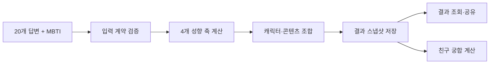

<div align="center">
  

# Pakit — 나 사용 설명서

**나를 하나의 장난감처럼 언박싱하고, 친구와 서로를 더 잘 이해하는 성향 테스트 서비스**

[서비스 바로가기](https://pakit.kr) · [API 문서](https://api.pakit.kr/docs)

</div>

## Pakit은 어떤 서비스인가요?

사람마다 가까워지는 속도도, 마음을 표현하는 방식도, 에너지를 충전하는 방법도 다릅니다.
Pakit은 일상적인 질문과 MBTI를 바탕으로 사용자의 성향을 분석하고, 그 결과를 **나 사용
설명서**로 만들어 줍니다.

딱딱한 유형명 대신 장난감 캐릭터, 포장 상자, 개봉 도구라는 친숙한 메타포를 사용합니다.
결과를 혼자 확인하는 데서 끝나지 않고 친구와 공유해, 두 사람의 거리감과 갈등 해결 방식,
마음을 주고받는 방식까지 함께 살펴볼 수 있습니다.

## 주요 기능

### 🧸 나를 닮은 장난감 찾기

- 20개 답변과 MBTI를 조합해 16종의 장난감 캐릭터 중 하나를 매칭합니다.
- 거리 조절, 표현 방식, 익숙함, 감성이라는 네 가지 성향 축을 0–100 점수로 보여줍니다.
- 성향에 맞는 포장 상자와 개봉 도구를 골라 “나를 알아가는 방법”을 시각적으로 표현합니다.

### 📖 나 사용 설명서 만들기

- 핵심 특징, 사용 방법, 주의사항, 충전 방법을 개인화된 문장으로 제공합니다.
- 결과 코드를 발급해 언제든 생성 당시의 결과를 다시 볼 수 있습니다.
- 카피가 업데이트되어도 기존 결과가 바뀌지 않도록 결과 전체를 스냅샷으로 보존합니다.

### 🤝 친구와 궁합 확인하기

- 두 사람의 결과 코드만으로 친구 궁합을 확인할 수 있습니다.
- 거리감, 갈등을 푸는 속도, 챙김 방식, 함께 움직이는 속도를 비교합니다.
- 하나의 점수에 그치지 않고 서로에게 필요한 팁과 관계를 오래 이어가는 방법을 제안합니다.

## 결과는 이렇게 만들어집니다

Pakit의 결과 문구는 생성형 AI가 아니라 **명시적인 규칙**으로 결정됩니다. 같은 입력에는 언제나
같은 결과가 나오고, 각 문장이 어떤 답변에서 비롯됐는지 추적할 수 있습니다.



- **계약 기반 입력 검증**: 버전이 지정된 문항·선택지 ID와 Pydantic 모델로 잘못된 제출을
  차단합니다.
- **결정적 분류 로직**: 점수, 캐릭터, 특징, 사용 방법과 주의사항을 도메인 규칙으로 조합합니다.
- **과거 결과 보존**: 결과 생성 시점의 콘텐츠를 PostgreSQL에 스냅샷으로 저장합니다.
- **개인정보 최소화**: 결과 표시용 닉네임만 저장하고 원본 답변은 저장하지 않습니다.

## 기술 스택

| 영역     | 기술                                         |
| -------- | -------------------------------------------- |
| API      | Python 3.12, FastAPI, Pydantic v2            |
| Database | PostgreSQL 17, SQLAlchemy 2.0 Async, Alembic |
| Package  | uv                                           |
| Quality  | pytest, coverage, Ruff, mypy                 |
| Deploy   | Docker, Docker Compose                       |

초기 제품에서 빠르게 규칙을 검증하면서도 도메인 경계를 지킬 수 있도록 **모듈형 모놀리스**로
구성했습니다.

## 로컬 개발

먼저 `.env.example`을 복사하고 `PAKIT_DATABASE_PASSWORD`와 `POSTGRES_PASSWORD`에 같은
로컬 DB 비밀번호를 설정합니다.

```bash
cp .env.example .env
```

로컬에서는 PostgreSQL만 Docker로 실행합니다. `compose.local.yaml`은 DB 포트를 로컬
루프백 주소에만 열며 배포에는 사용하지 않습니다.

```bash
docker compose -f compose.yaml -f compose.local.yaml up -d db
uv run alembic upgrade head
uv run uvicorn pakit.main:app --reload
```

### 운영 어드민과 백엔드 통계

읽기 전용 어드민은 다음 환경변수를 모두 설정해야 열립니다. 하나라도 비어 있으면 `/admin`과
`/api/admin/*`는 `503`으로 닫힙니다. 운영에서는 반드시 HTTPS와 배포 앞단의 접근 제어를 함께
사용하세요.

```dotenv
PAKIT_ADMIN_USERNAME=operator
PAKIT_ADMIN_PASSWORD=충분히-긴-임의의-비밀번호
PAKIT_USAGE_TRACKING_STARTED_AT=2026-08-20T18:00:00+09:00
```

- `/admin`: 생성 결과·궁합 현황과 최근 7일 추이
- `/admin/results`: 전체 결과 검색과 상세 스냅샷
- `/admin/analytics`: MBTI·장난감·키워드·성향·궁합 분포

`PAKIT_USAGE_TRACKING_STARTED_AT`은 `backend_usage_events` 계측을 실제로 배포한 시각입니다.
설정하지 않으면 과거 결과를 미사용자로 오해하지 않도록 궁합 경험 비율을 표시하지 않습니다.
공개 결과 조회와 궁합 계산의 성공 요청만 기록하며 닉네임, 원본 답변, IP, User-Agent는 사용
기록에 저장하지 않습니다. 프론트 페이지뷰·클릭·유입 분석은 GA에서 관리합니다.

개발을 마치면 DB 컨테이너만 중지할 수 있습니다. `postgres_data` 볼륨은 그대로 유지됩니다.

```bash
docker compose -f compose.yaml -f compose.local.yaml stop db
```

## Docker Compose로 배포하기

배포 서버에서는 기존 `compose.yaml`로 API, PostgreSQL, 프론트엔드를 함께 실행합니다. 이때
백엔드 저장소의 상위 경로에 `frontend-app`이 있어야 합니다.

```bash
docker compose up --build -d
```

운영 PostgreSQL은 외부 포트를 열지 않고 Docker 내부 네트워크에서만 접근합니다. 데이터는
`postgres_data` 볼륨에 저장되므로 일반적인 컨테이너 재시작과 재배포 후에도 유지됩니다. API
컨테이너는 시작 전에 `alembic upgrade head`를 자동 실행합니다. `docker compose down -v`는
데이터 볼륨까지 삭제하므로 운영 서버에서 실행하지 않습니다.

## 자주 쓰는 명령

```bash
uv run pytest
uv run ruff check .
uv run ruff format --check .
uv run mypy
```

자동 수정은 `uv run ruff check --fix .`와 `uv run ruff format .`을 사용합니다.

## 구조

```text
src/pakit/
├── api/          # HTTP 라우터와 요청·응답 계약
├── domain/       # 프레임워크에 의존하지 않는 도메인 모델
├── services/     # 분류, 결과 조합, 궁합 계산 유스케이스
├── core/         # 설정, 데이터베이스 등 런타임 기반 코드
├── static/       # 캐릭터와 결과 페이지 이미지
└── web/          # 콘텐츠 검수용 내부 도구
```

## API

| Method | Endpoint                                       | 설명                           |
| ------ | ---------------------------------------------- | ------------------------------ |
| `POST` | `/api/tests/submissions`                       | 답변을 제출하고 개인 결과 생성 |
| `GET`  | `/api/tests/submissions/count`                 | 누적 테스트 완료 수 조회       |
| `GET`  | `/api/results/{result_code}`                   | 저장된 결과 조회               |
| `GET`  | `/api/compatibility?mine={code}&friend={code}` | 두 결과의 친구 궁합 조회       |
| `GET`  | `/health`                                      | 서버 상태 확인                 |

서버 실행 후 [Swagger UI](http://localhost:8000/docs)에서 실제 요청·응답 예시와 에러 계약을
확인할 수 있습니다.

## 프로젝트 문서

- [백엔드 설계와 제품 결정](docs/architecture.md)
- [문항·선택지 계약](docs/assessment-identifiers.v1.json)
- [결과 페이지 API 계약](docs/result-page-contract.md)
- [친구 궁합 계산 규칙](docs/compatibility-rules.md)
- [제품 요구사항](PRD_%E1%84%82%E1%85%A1%E1%84%89%E1%85%A1%E1%84%8B%E1%85%AD%E1%86%BC%E1%84%89%E1%85%A5%E1%86%AF%E1%84%86%E1%85%A7%E1%86%BC%E1%84%89%E1%85%A5.html)

---

<div align="center">
  서로를 이해하는 가장 재미있는 방법, <strong>Pakit</strong>
</div>
