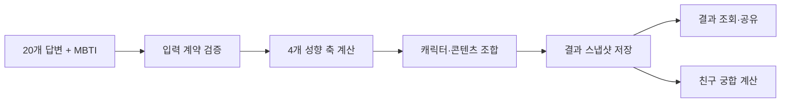

<div align="center">
  

# Pakit — 나 사용 설명서

**나를 하나의 장난감처럼 언박싱하고, 친구와 서로를 더 잘 이해하는 성향 테스트 서비스**

[서비스 바로가기](https://pakit.kr) · [API 문서](https://api.pakit.kr/docs)

</div>

## Pakit은 어떤 서비스인가요?

사람마다 가까워지는 속도도, 마음을 표현하는 방식도, 에너지를 충전하는 방법도 다릅니다.
Pakit은 일상적인 질문과 MBTI를 바탕으로 사용자의 성향을 분석하고, 그 결과를 **나 사용
설명서**로 만들어 줍니다.

딱딱한 유형명 대신 장난감 캐릭터, 포장 상자, 개봉 도구라는 친숙한 메타포를 사용합니다.
결과를 혼자 확인하는 데서 끝나지 않고 친구와 공유해, 두 사람의 거리감과 갈등 해결 방식,
마음을 주고받는 방식까지 함께 살펴볼 수 있습니다.

## 주요 기능

### 🧸 나를 닮은 장난감 찾기

- 20개 답변과 MBTI를 조합해 16종의 장난감 캐릭터 중 하나를 매칭합니다.
- 거리 조절, 표현 방식, 익숙함, 감성이라는 네 가지 성향 축을 0–100 점수로 보여줍니다.
- 성향에 맞는 포장 상자와 개봉 도구를 골라 “나를 알아가는 방법”을 시각적으로 표현합니다.

### 📖 나 사용 설명서 만들기

- 핵심 특징, 사용 방법, 주의사항, 충전 방법을 개인화된 문장으로 제공합니다.
- 결과 코드를 발급해 언제든 생성 당시의 결과를 다시 볼 수 있습니다.
- 카피가 업데이트되어도 기존 결과가 바뀌지 않도록 결과 전체를 스냅샷으로 보존합니다.

### 🤝 친구와 궁합 확인하기

- 두 사람의 결과 코드만으로 친구 궁합을 확인할 수 있습니다.
- 거리감, 갈등을 푸는 속도, 챙김 방식, 함께 움직이는 속도를 비교합니다.
- 하나의 점수에 그치지 않고 서로에게 필요한 팁과 관계를 오래 이어가는 방법을 제안합니다.

### 🔐 선택적으로 결과 모아보기

- 로그인하지 않아도 테스트, 결과 공유와 친구 궁합을 모두 사용할 수 있습니다.
- 카카오 로그인 후 브라우저에 저장한 결과 코드를 계정에 연결할 수 있습니다.
- 연결된 결과와 해당 결과들로 완료한 궁합 이력은 다른 기기에서도 다시 볼 수 있습니다.

## 결과는 이렇게 만들어집니다

Pakit의 결과 문구는 생성형 AI가 아니라 **명시적인 규칙**으로 결정됩니다. 같은 입력에는 언제나
같은 결과가 나오고, 각 문장이 어떤 답변에서 비롯됐는지 추적할 수 있습니다.


```mermaid
flowchart LR
    A[20개 답변 + MBTI] --> B[입력 계약 검증]
    B --> C[4개 성향 축 계산]
    C --> D[캐릭터·콘텐츠 조합]
    D --> E[결과 스냅샷 저장]
    E --> F[결과 조회·공유]
    E --> G[친구 궁합 계산]
```

- **계약 기반 입력 검증**: 버전이 지정된 문항·선택지 ID와 Pydantic 모델로 잘못된 제출을
  차단합니다.
- **결정적 분류 로직**: 점수, 캐릭터, 특징, 사용 방법과 주의사항을 도메인 규칙으로 조합합니다.
- **과거 결과 보존**: 결과 생성 시점의 콘텐츠를 PostgreSQL에 스냅샷으로 저장합니다.
- **원본 응답 보존**: 새 테스트 제출마다 `assessment_results.response_snapshot`에 질문지 버전,
  MBTI, 20개 문항의 ID·선택값을 결과와 같은 트랜잭션으로 저장합니다. 결과 표시용 닉네임은
  기존 결과 스냅샷에 유지합니다. 원본 응답은 공개 제출·결과·궁합 API에 노출하지 않습니다.
  기존 결과의 원본 응답은 `NULL`이며 역산하지 않습니다. 질문·선택지 원문은 해당 질문지
  버전 자료와 연결합니다. 보존 기간과 삭제 정책은 별도 제품 결정으로 남아 있습니다.
- 원본 응답 저장 배포 전 `uv run alembic upgrade head`로 `20260908_04`를 적용해야 합니다.
  이 마이그레이션을 되돌리면 원본 응답 컬럼과 그 데이터는 삭제되고 결과 스냅샷은 유지됩니다.

## 기술 스택

| 영역     | 기술                                         |
| -------- | -------------------------------------------- |
| API      | Python 3.12, FastAPI, Pydantic v2            |
| Database | PostgreSQL 17, SQLAlchemy 2.0 Async, Alembic |
| Package  | uv                                           |
| Quality  | pytest, coverage, Ruff, mypy                 |
| Deploy   | Docker, Docker Compose                       |

초기 제품에서 빠르게 규칙을 검증하면서도 도메인 경계를 지킬 수 있도록 **모듈형 모놀리스**로
구성했습니다.

## 로컬 개발

먼저 `.env.example`을 복사하고 `PAKIT_DATABASE_PASSWORD`와 `POSTGRES_PASSWORD`에 같은
로컬 DB 비밀번호를 설정합니다.

```bash
cp .env.example .env
```

로컬에서는 PostgreSQL만 Docker로 실행합니다. `compose.local.yaml`은 DB 포트를 로컬
루프백 주소에만 열며 배포에는 사용하지 않습니다.

```bash
docker compose -f compose.yaml -f compose.local.yaml up -d db
uv run alembic upgrade head
uv run uvicorn pakit.main:app --reload --port 8001
```

### 운영 어드민과 백엔드 통계

읽기 전용 어드민은 다음 환경변수를 모두 설정해야 열립니다. 하나라도 비어 있으면 `/admin`과
`/api/admin/*`는 `503`으로 닫힙니다. 운영에서는 반드시 HTTPS와 배포 앞단의 접근 제어를 함께
사용하세요.

```dotenv
PAKIT_ADMIN_USERNAME=operator
PAKIT_ADMIN_PASSWORD=충분히-긴-임의의-비밀번호
PAKIT_USAGE_TRACKING_STARTED_AT=2026-08-20T18:00:00+09:00
```

- `/admin`: 생성 결과·고유 결과 코드 조합 기준 궁합 현황과 최근 7일 추이
- `/admin/results`: 전체 결과 검색, 고유 궁합 상대 수와 상세 스냅샷
- `/admin/analytics`: 궁합 도달 결과·비율과 MBTI·장난감·키워드·성향·고유 궁합 조합 분포

`PAKIT_USAGE_TRACKING_STARTED_AT`은 `backend_usage_events` 계측을 실제로 배포한 시각입니다.
궁합 경험 비율은 이 시각과 관계없이 전체 결과 코드를 분모로 사용합니다.
공개 결과 조회와 궁합 계산의 성공 요청만 기록하며 닉네임, 원본 답변, IP, User-Agent는 사용
기록에 저장하지 않습니다. 프론트 페이지뷰·클릭·유입 분석은 GA에서 관리합니다.

### 카카오 로그인

카카오 로그인은 선택 기능입니다. 설정하지 않아도 기존 비회원 테스트·공유·궁합 API는 그대로
동작하며 인증 API만 `503`을 반환합니다.

```dotenv
PAKIT_KAKAO_REST_API_KEY=
PAKIT_KAKAO_CLIENT_SECRET=
PAKIT_KAKAO_REDIRECT_URI=https://api.pakit.kr/api/auth/kakao/callback
PAKIT_FRONTEND_AUTH_REDIRECT_URL=https://pakit.kr/auth/complete
PAKIT_SESSION_SECRET=충분히-긴-임의의-서명키
PAKIT_SESSION_MAX_AGE_SECONDS=2592000
```

카카오 개발자 콘솔에도 `PAKIT_KAKAO_REDIRECT_URI`와 동일한 Redirect URI를 등록해야 합니다.
서버는 카카오 회원번호만 저장하고 이메일·프로필과 카카오 액세스·리프레시 토큰은 저장하지
않습니다. 프론트엔드는 로그인 완료 후 localStorage의 결과 코드들을
`POST /api/auth/me/results/sync`로 보내 계정에 연결합니다.
로그인 시작 API의 `return_to`는 상대경로 또는 서버의 CORS 허용 목록에 등록된 프론트엔드
origin의 절대 URL만 허용합니다. 따라서 로컬 프론트엔드에서 시작한 로그인은 로컬 주소로,
운영 프론트엔드에서 시작한 로그인은 운영 주소로 돌아가며 그 밖의 외부 주소는 무시합니다.
로컬 프론트엔드는 로컬 API와 DB에 연결하고, 운영 프론트엔드만 운영 API와 DB를 사용합니다.
이렇게 하면 인증 세션은 각 환경의 HttpOnly `SameSite=Lax` 쿠키로만 유지되며 로컬 개발을 위해
운영 세션이나 운영 DB를 공유하지 않습니다.

개발을 마치면 DB 컨테이너만 중지할 수 있습니다. `postgres_data` 볼륨은 그대로 유지됩니다.

```bash
docker compose -f compose.yaml -f compose.local.yaml stop db
```

## Docker Compose로 배포하기

배포 서버에서는 기존 `compose.yaml`로 API, PostgreSQL, 프론트엔드를 함께 실행합니다. 이때
백엔드 저장소의 상위 경로에 `frontend-app`이 있어야 합니다.

```bash
docker compose up --build -d
```

운영 PostgreSQL은 외부 포트를 열지 않고 Docker 내부 네트워크에서만 접근합니다. 데이터는
`postgres_data` 볼륨에 저장되므로 일반적인 컨테이너 재시작과 재배포 후에도 유지됩니다. API
컨테이너는 시작 전에 `alembic upgrade head`를 자동 실행합니다. `docker compose down -v`는
데이터 볼륨까지 삭제하므로 운영 서버에서 실행하지 않습니다.

## 자주 쓰는 명령

```bash
uv run pytest
uv run ruff check .
uv run ruff format --check .
uv run mypy
```

자동 수정은 `uv run ruff check --fix .`와 `uv run ruff format .`을 사용합니다.

## 구조

```text
src/pakit/
├── api/          # HTTP 라우터와 요청·응답 계약
├── domain/       # 프레임워크에 의존하지 않는 도메인 모델
├── services/     # 분류, 결과 조합, 궁합 계산 유스케이스
├── core/         # 설정, 데이터베이스 등 런타임 기반 코드
├── static/       # 캐릭터와 결과 페이지 이미지
└── web/          # 콘텐츠 검수용 내부 도구
```

## API

| Method | Endpoint                                           | 설명                           |
| ------ | -------------------------------------------------- | ------------------------------ |
| `POST` | `/api/tests/submissions`                           | 답변을 제출하고 개인 결과 생성 |
| `GET`  | `/api/tests/submissions/count`                     | 누적 테스트 완료 수 조회       |
| `GET`  | `/api/results/{result_code}`                       | 저장된 결과 조회               |
| `GET`  | `/api/results/{result_code}/compatibility-ranking` | 내 코드의 케미 점수 랭킹 조회  |
| `GET`  | `/api/compatibility?mine={code}&friend={code}`     | 두 결과의 친구 궁합 조회       |
| `POST` | `/api/relationship-reports/romantic`               | AI 연인 관계 설명서 생성        |
| `POST` | `/api/payments/kakaopay/ready`                    | 카카오페이 단건결제 준비        |
| `GET`  | `/api/payments/kakaopay/{order_id}/approve`       | 카카오페이 결제 승인 콜백       |
| `GET`  | `/api/payments/kakaopay/{order_id}`               | 내 결제 주문 상태 조회          |
| `POST` | `/api/relationship-reports/romantic/orders/{order_id}` | 결제한 관계 설명서 생성     |
| `GET`  | `/api/auth/kakao/login`                           | 카카오 로그인 시작             |
| `GET`  | `/api/auth/me`                                    | 현재 로그인 사용자 조회        |
| `POST` | `/api/auth/logout`                                | Pakit 로그아웃                  |
| `POST` | `/api/auth/me/results/sync`                       | 로컬 결과 코드를 계정에 연결    |
| `GET`  | `/api/auth/me/results`                            | 내 테스트 결과 목록 조회       |
| `GET`  | `/api/auth/me/compatibilities`                    | 내 친구 궁합 이력 조회          |
| `GET`  | `/health`                                          | 서버 상태 확인                 |

관리자 화면 `/admin`은 기존 결과·통계 화면에 조회 전용 `결제 내역`, `로그인 유저`,
`유료 결과` 탭을 추가로 제공합니다. 각 탭은 `/api/admin/payments`, `/api/admin/users`,
`/api/admin/paid-reports` 목록·상세 API를 사용하며 기존 관리자 Basic 인증을 동일하게 요구합니다.

서버 실행 후 [Swagger UI](http://localhost:8000/docs)에서 실제 요청·응답 예시와 에러 계약을
확인할 수 있습니다.

## 프로젝트 문서

- [백엔드 설계와 제품 결정](docs/architecture.md)
- [문항·선택지 계약](docs/assessment-identifiers.v1.json)
- [결과 페이지 API 계약](docs/result-page-contract.md)
- [친구 궁합 계산 규칙](docs/compatibility-rules.md)
- [제품 요구사항](PRD_%E1%84%82%E1%85%A1%E1%84%89%E1%85%A1%E1%84%8B%E1%85%AD%E1%86%BC%E1%84%89%E1%85%A5%E1%86%AF%E1%84%86%E1%85%A7%E1%86%BC%E1%84%89%E1%85%A5.html)

---

<div align="center">
  서로를 이해하는 가장 재미있는 방법, <strong>Pakit</strong>
</div>

## 유료 AI 관계 설명서 실험

연인용 프롬프트와 입력 변환 규칙은
[프롬프트 사용 안내](src/pakit/prompts/relationship/README.md)에 정리되어 있습니다.
`POST /api/relationship-reports/romantic`은 두 결과 코드와 각 성별을 받아 저장된 원본 응답을
성향 프로필로 바꾸고 OpenAI Responses API로 관계 설명서를 생성합니다. 같은 입력·모델·문구
버전의 생성 결과는 DB에서 재사용합니다. 운영 전에 `20261007_06`까지 마이그레이션을 적용하고
`PAKIT_OPENAI_API_KEY`, `PAKIT_OPENAI_MODEL`을 설정해야 합니다. 결제 권한 검증은 아직
없는 기존 endpoint이므로 이 단계에서는 품질 검증용 API로 취급합니다.
`PAKIT_ROMANTIC_REPORT_BETA_ACCESS_CODE`에 베타 코드를 설정하고, 허용할 클라이언트만
같은 값을 `X-Pakit-Beta-Code` 요청 헤더로 보내야 합니다. 코드는 URL이나 요청 본문에 넣지
않으며, 유출되면 환경변수 값을 교체해 폐기합니다.
AI 생성 요청은 최대 150초까지 기다리며, 운영 Nginx는
`deploy/nginx/pakit-api-timeouts.conf`의 180초 upstream 제한을 배포 시 적용합니다.

카카오페이 개발 결제는 `PAKIT_KAKAOPAY_CID=TC0ONETIME`과 발급받은
`PAKIT_KAKAOPAY_SECRET_KEY` 개발 키를 사용합니다. 로그인 사용자는 본인 계정에 연결된 결과와
상대 결과·성별을 `POST /api/payments/kakaopay/ready`로 보내고, 응답의 접속 환경별 URL로
이동합니다. 승인 콜백이 완료된 주문만
`POST /api/relationship-reports/romantic/orders/{order_id}`에서 관계 설명서를 생성할 수 있습니다.
결제 준비 요청의 `Origin`이 서버의 CORS 허용 목록에 있으면 승인·취소·실패 후에도 해당
프론트엔드 origin의 결제 완료 페이지로 돌아갑니다. 허용되지 않은 origin은 아래 설정값으로
대체됩니다.
GitHub Actions 배포를 사용하려면 저장소 Secrets에 다음 값을 등록해야 하며, 배포 워크플로가
가비아 서버의 `.env`에 자동 반영합니다.

```dotenv
PAKIT_KAKAOPAY_CID=TC0ONETIME
PAKIT_KAKAOPAY_SECRET_KEY=카카오페이-Secret-key(dev)
PAKIT_FRONTEND_PAYMENT_REDIRECT_URL=https://pakit.kr/payments/kakaopay/complete
```

운영 결제를 시작할 때는 테스트 CID와 개발 키를 계약 후 발급받은 운영 CID와 운영 Secret key로
교체해야 합니다. 카카오페이 Developers의 Web 플랫폼에는 결제 콜백을 받는
`https://api.pakit.kr` 도메인을 등록합니다.
가격은 클라이언트 입력을 받지 않고 서버에서 990원으로 고정합니다.
결제 주문은 향후 다른 상품도 사용할 수 있도록 상품 코드·표시명·가격과 상품별 payload의
불변 스냅샷을 저장하며, 현재 관계 설명서만 `romantic-report-v1` payload를 해석합니다.
